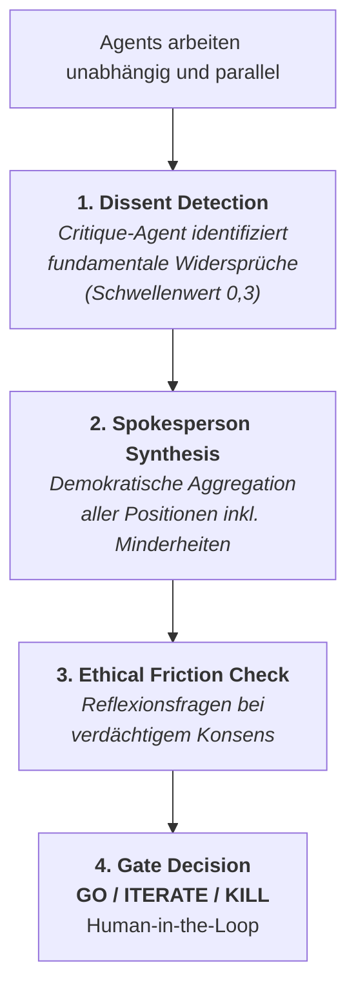
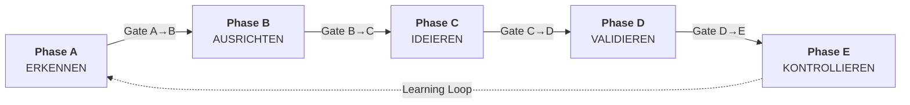

# Agentic Innovation Process (AIP): Ein Multi-Agent-Framework zur Optimierung von Innovationsprozessen in Startups mit ungenutztem Innovationspotenzial

**Projektarbeit**

zur Erlangung des akademischen Grades **‹TODO: Bachelor/Master of … ›** im Studiengang **‹TODO: Studiengang einsetzen›**

| Verfasser | Lou Lazay |
|-----------|-----------|
| Matrikelnummer | ‹TODO einsetzen› |
| Studiengang | ‹TODO einsetzen› |
| Erstprüfer/in | ‹TODO einsetzen› |
| Zweitprüfer/in | ‹TODO einsetzen› |
| Abgabedatum | ‹TODO einsetzen› |

**HTWG Konstanz — Hochschule für Technik, Wirtschaft und Gestaltung**

Konstanz, April 2026

---

## Abstract

Startups mit ungenutztem Innovationspotenzial stehen vor einem Dilemma: Etablierte Innovationsmethoden setzen strukturierte Daten, dedizierte Teams und zeitintensive Prozesse voraus — Ressourcen, über die viele Startups nicht verfügen. Gleichzeitig ermöglichen agentische KI-Systeme neue Formen der autonomen Planung, Analyse und Koordination. Diese Arbeit adressiert die identifizierte Forschungslücke, dass kein publiziertes Framework agentische KI-Fähigkeiten systematisch auf Innovationsprozess-Phasen abbildet. Methodisch folgt die Arbeit dem Design-Science-Research-Paradigma nach Hevner et al. (2004) und Peffers et al. (2007). Mit dem Agentic Innovation Process (AIP) wird ein neuartiges Framework vorgestellt, das auf einem Hybridansatz aus BIG Picture, Lean Startup, JTBD und BMC basiert und mehrere eigene Konzepte einführt: eine Orchestrated Feedback Hierarchy (OFH) als demokratisches Agent-Governance-Modell, einen Dissens-als-Innovationssignal-Mechanismus, ein Startup Genome mit Innovations-Treiber-Score (IT-Score) sowie ein Ethical-Friction-Protokoll gegen künstlichen Konsens. Die Validierung erfolgt über einen prototypischen Proof of Concept (Python, LangGraph, Pydantic) und eine Meta-Validierung (ClientZero), bei der das Forschungsprojekt selbst als erster Testcase den AIP-Prozess durchläuft. Im Sinne der Knowledge Contribution Matrix nach Gregor und Hevner (2013) positioniert sich der Beitrag als *Exaptation* — die Anwendung reifer Lösungsartefakte (Innovationsframeworks, MAS-Patterns) auf einen neuartigen Problemraum (agentische KI-Orchestrierung in Innovationsprozessen).

**Schlüsselwörter:** Agentic AI, Multi-Agent-Systeme, Innovationsmanagement, Startups, Agent-Governance, Human-AI-Collaboration, Design Science Research

---

## Inhaltsverzeichnis

*Wird beim PDF-Export automatisch generiert (Pandoc: `--toc --toc-depth=3`).*

---

## Abbildungsverzeichnis

| Nr. | Titel | Kapitel |
|-----|-------|---------|
| Abbildung 1 | OFH-Architektur — vierstufiger Governance-Prozess | 4.3 |
| Abbildung 2 | AIP-Phasenmodell mit Gates und Learning Loop | 4.6 |

## Tabellenverzeichnis

| Nr. | Titel | Kapitel |
|-----|-------|---------|
| Tabelle 1 | Bewertungsmatrix ausgewählter Innovationsframeworks | 2.2 |
| Tabelle 2 | DSRM-Mapping nach Peffers et al. (2007) | 3.1 |
| Tabelle 2a | Triangulationsmatrix — Methoden × evaluative Kernbehauptungen | 3.2 |
| Tabelle 3 | Design-Anforderungen mit theoretischer Fundierung | 3.4 |
| Tabelle 4 | AIP-Architektur — Phasen und Layers mit DR-Zuordnung | 4.1 |
| Tabelle 5 | Design-Rationale — Framework-Rollen mit Kernel Theories | 4.2 |
| Tabelle 6 | Abgrenzung AIP — gemeinsame Merkmale und Alleinstellungsmerkmale | 4.2 |
| Tabelle 7 | Graceful Degradation nach Datenreifegrad | 4.4 |
| Tabelle 8 | IT-Score-Gewichtung mit Rationale | 4.5 |
| Tabelle 9 | Technologie-Stack des Prototyps | 5.1 |
| Tabelle 10 | Eingabeprofil DataPulse Analytics für den ausgeführten Validierungslauf | 5.4 |
| Tabelle 10a | Vom Gap Detector Agent identifizierte Innovationslücken (Phase A) | 5.4 |
| Tabelle 11 | Startup Genome des Forschungsprojekts (ClientZero) | 5.5.2 |
| Tabelle 12 | ClientZero — Phasenanwendung mit typisierten Outputs | 5.5.3 |
| Tabelle 13 | ClientZero — Quantitative Metriken | 5.5.5 |
| Tabelle 14 | Evaluation gegen Design-Anforderungen | 5.6 |

## Abkürzungsverzeichnis

| Abkürzung | Bedeutung |
|-----------|-----------|
| AIP | Agentic Innovation Process |
| API | Application Programming Interface |
| BMC | Business Model Canvas |
| DR | Design Requirement (Design-Anforderung) |
| DSR | Design Science Research |
| DSRM | Design Science Research Methodology |
| IT-Score | Innovations-Treiber-Score |
| JTBD | Jobs to be Done |
| L1–L7 | Layer 1 bis Layer 7 (Cross-Cutting Layers des AIP) |
| LLM | Large Language Model |
| MAS | Multi-Agent-System |
| MCP | Model Context Protocol |
| MVP | Minimum Viable Product |
| OFH | Orchestrated Feedback Hierarchy |
| SaaS | Software as a Service |

---

## 1. Einleitung

### 1.1 Problemstellung

Agentische KI-Systeme erleben ein rasantes Marktwachstum. Branchenanalysten prognostizieren eine Vervielfachung des Marktvolumens bis 2030 (vgl. Gartner, 2025; McKinsey, 2025a), und die Nachfrage nach Multi-Agent-Systemen ist seit 2024 signifikant gestiegen (Gartner, 2025). Dieser Trend signalisiert einen Paradigmenwechsel von experimentellen Pilotprojekten zu produktionskritischen Implementierungen.

Gleichzeitig kämpfen Startups, die ihre initiale Wachstumsphase überschritten haben, häufig mit Innovationsstagnation. Die Organisationsforschung erklärt dies über das Konzept der organisationalen Ambidextrie (O'Reilly & Tushman, 2004): Erfolgreiche Startups tendieren dazu, bewährte Geschäftsmodelle übermäßig zu exploitieren (*Exploitation*), während die Exploration neuer Möglichkeiten vernachlässigt wird. March (1991) formalisiert dieses Spannungsfeld als fundamentalen Trade-off zwischen der Verfeinerung bestehender Kompetenzen und der Erschließung neuer Möglichkeiten. Die resultierende Innovationsblockade wird durch begrenzte Ressourcen, fehlende strukturierte Daten und das Fehlen dedizierter Innovationsteams verschärft — Phänomene, die bereits Christensen (1997) im Kontext des *Innovator's Dilemma* beschreibt.

Etablierte Innovationsframeworks wie Stage-Gate (Cooper, 1990), Design Thinking (Brown, 2008) oder Lean Startup (Ries, 2011) adressieren zwar den Innovationsprozess systematisch, setzen jedoch implizit Bedingungen voraus, die ressourcenlimitierte Startups selten erfüllen: umfangreiche Marktdaten, interdisziplinäre Teams und iterative Prototyping-Zyklen über Monate hinweg (vgl. Tidd & Bessant, 2021).

### 1.2 Forschungslücke und Forschungsfrage

Während die Forschung an der Schnittstelle von KI und Innovation wächst — Mariani et al. (2023) identifizieren in einem systematischen Review mit 1.448 Artikeln über 70 offene Forschungsfragen — existiert eine fundamentale Lücke: **Es gibt kein publiziertes Framework, das agentische KI-Fähigkeiten (autonome Planung, Tool-Nutzung, Multi-Step-Reasoning, Multi-Agent-Koordination) systematisch auf etablierte Innovationsprozess-Phasen abbildet** (vgl. Jain & Agrawal, 2024; Gama et al., 2025).

Verganti et al. (2020) zeigen zwar den Shift von *Problem-Solving* zu *Problem-Finding* durch KI, Bouschery und Piller (2023) dokumentieren die Augmentierung von Innovationsteams durch LLMs, und Shrestha et al. (2019) entwickeln Entscheidungsstrukturen für Human-AI-Kollaboration — doch keines dieser Werke operationalisiert agentische Multi-Agent-Systeme als integralen Bestandteil eines phasenübergreifenden Innovationsframeworks. Xi et al. (2023) liefern zwar einen umfassenden Survey zu LLM-basierten Agenten, fokussieren jedoch auf technische Architekturen ohne Bezug zu domänenspezifischen Anwendungen im Innovationsmanagement.

Daraus ergibt sich die zentrale **Forschungsfrage**:

> *Inwiefern können agentische KI-Systeme, auf Basis eines Hybridframeworks aus etablierten Innovationsmodellen, den Innovationsprozess in Startups mit ungenutztem Innovationspotenzial durch phasenübergreifende Multi-Agent-Orchestration optimieren?*

Mit drei Unterfragen:

1. Wie lassen sich etablierte Innovationsframeworks in diskrete Agenten-Rollen und -Aufgaben dekonstruieren?
2. Welche Koordinationsmechanismen sind erforderlich, damit ein Multi-Agent-System kohärent und vertrauenswürdig arbeitet?
3. Inwiefern unterscheidet sich die Effektivität der agentischen Unterstützung je nach Datenreifegrad?

Die Arbeit leistet vier spezifische Beiträge: (1) ein konzeptuelles Framework, das agentische KI erstmals systematisch auf Innovationsphasen abbildet, (2) den OFH-Mechanismus als neuartiges Agent-Governance-Modell mit Dissens-als-Innovationssignal, (3) einen Open-Source-Prototyp als Proof of Concept, und (4) die ClientZero-Methode als Meta-Validierungsstrategie für Framework-Forschung.

### 1.3 Scope und Aufbau der Arbeit

**Scope.** Diese Projektarbeit liefert einen *konzeptionellen Beitrag* — das AIP-Framework mit seinen fünf eigenständigen Konstrukten — sowie einen *Existenzbeweis durch Selbstanwendung* (ClientZero). Die wissenschaftliche Aussage ist damit zweistufig: (1) das Framework ist konzeptionell kohärent und prototypisch realisierbar; (2) es ist auf seinen eigenen Entstehungsprozess anwendbar und hat sich durch diese Anwendung nachweislich weiterentwickelt. Die *empirische Wirksamkeitsüberprüfung* an externen Startups, die vollständige Implementierung der Phasen B–E sowie kontrollierte Vergleichsstudien sind explizit nicht Bestandteil dieser Arbeit, sondern Gegenstand expliziter Folgearbeit (Kap. 7.2). Diese Scope-Setzung entspricht der Design-Science-Anforderung, ein nascent Artefakt deskriptiv zu evaluieren (Hevner et al., 2004, Guideline 3), bevor experimentelle Validierung sinnvoll möglich wird.

**Aufbau.** Kapitel 2 legt die theoretischen Grundlagen zu agentischer KI, Innovationsframeworks und Multi-Agent-Governance. Kapitel 3 beschreibt die Methodik (Design Science Research, methodische Triangulation, Design-Anforderungen). Kapitel 4 präsentiert das AIP-Framework als Kernbeitrag. Kapitel 5 dokumentiert die prototypische Implementierung und die ClientZero-Validierung. Kapitel 6 diskutiert die Ergebnisse, ordnet sie wissenschaftlich ein und benennt Limitationen. Kapitel 7 zieht Fazit und gibt einen Ausblick mit klarer Trennung zwischen den Beiträgen dieser Arbeit und der Folgeforschung.

---

## 2. Theoretische Grundlagen

### 2.1 Agentische KI-Systeme

Agentische KI-Systeme (Agentic AI) gehen über klassische Generative AI hinaus und zeichnen sich durch Autonomie, Zielorientierung, Adaptivität, Vernetzung und Selbstreflexion aus (Weng, 2023). Im Kern fungiert ein Large Language Model (LLM) als „Gehirn" des Agenten, ergänzt durch Planung, Speicherverwaltung und Tool-Integration. Die Evolution verläuft von LLM-gestützten Assistenten (2023–2024) über autonome Agenten (2025) hin zu Multi-Agent-Systemen in Produktion (2026) (Bain & Company, 2025). Technisch ermöglichen Ansätze wie Chain-of-Thought-Prompting (Wei et al., 2022) und ReAct (Yao et al., 2023) die Verschränkung von Reasoning und Handlungsfähigkeit, die agentische Systeme von passiven Sprachmodellen unterscheidet.

Multi-Agent-Systeme (MAS) koordinieren mehrere spezialisierte Agenten zur Bearbeitung komplexer Aufgaben. Die MAS-Forschung reicht bis Wooldridge und Jennings (1995) zurück, die grundlegende Architekturen für kooperative und kompetitive Agenten formalisiert haben. Zentrale Orchestrierungsmuster umfassen hierarchische, demokratische und hybride Ansätze (IBM, 2025). Park et al. (2023) demonstrieren mit *Generative Agents*, dass LLM-basierte Agenten komplexe soziale Verhaltensweisen emergent entwickeln können — ein Befund, der die Eignung von Multi-Agent-Systemen für kreative Aufgaben wie Innovation unterstreicht.

Aktuelle Marktindikatoren stammen überwiegend aus Branchenanalysen, die methodisch nicht den Standards peer-reviewed Forschung entsprechen, jedoch als Frühindikator für Adoption und Reifegrad relevant sind und daher mit explizitem Verweis auf ihren Status zitiert werden: Eine Gartner-Analyse (2025) berichtet von einer Prozessabdeckung agentischer MAS im Enterprise-Kontext von 80 % gegenüber 20–30 % bei klassischer Automatisierung. McKinsey (2025a) prägt in einem Beratungsbericht den Begriff des „Agentic AI Mesh" als Orchestrierungsschicht und identifiziert *Agent Sprawl* und *Autonomy Drift* als zentrale Skalierungsrisiken — ein praxisnaher Beobachtungsbefund, kein empirisch validiertes Modell. Eine Deloitte-Analyse (2025) bestätigt die wachsende Enterprise-Adoption und betont die Notwendigkeit domänenspezifischer Governance. Eine Branchenerhebung von G2 (2026) berichtet, dass weniger als 10 % der Organisationen erfolgreich über Single-Agent-Deployments hinaus skalieren — ein Indiz für die praktische Bedeutung geeigneter Governance-Mechanismen, das peer-reviewed Forschung jedoch noch zu validieren bleibt.

### 2.2 Innovationsframeworks und ihre KI-Potenziale

Für die Konstruktion des AIP-Frameworks wurden sechs etablierte Innovationsmodelle anhand von fünf Kriterien strukturiert verglichen: Prozessklarheit, Startup-Eignung, Stagnationsrelevanz, Business-Model-Innovation-Fokus und KI-Automatisierbarkeit. Die folgende Tabelle ist methodisch ausdrücklich als **argumentative Vorauswahl mit transparenten Kriterien** zu lesen, nicht als Messung: Die Scores stellen eine literaturgestützte Einzelbewertung des Autors auf Basis der jeweiligen Primärliteratur dar. Sie ersetzen weder eine empirische Frameworkbewertung noch eine systematische Literaturanalyse mit Inter-Rater-Reliability — beides wäre für eine Projektarbeit weder leistbar noch erforderlich, da die Auswahl letztlich nicht durch die Punktsumme entschieden wird, sondern durch die *theoretische Komplementarität* der ausgewählten Bausteine (vgl. Kap. 4.2). Die Tabelle dient der nachvollziehbaren Begründung, *warum* gerade diese Bausteine in den Hybridansatz eingehen, und macht die Entscheidungsgrundlagen offen kritisierbar. Die Skala (1 = kaum gegeben, 5 = voll gegeben) operationalisiert die Kriterien qualitativ-vergleichend; ein intersubjektiver Validitätsnachweis der Scores ist nicht Bestandteil dieser Arbeit und wird im Ausblick als Folgearbeit benannt.

| Framework | Prozess | Startup | Stagnation | BMI | KI | Σ |
|-----------|:---:|:---:|:---:|:---:|:---:|:---:|
| BIG Picture (Lercher) | 5 | 3 | 5 | 3 | 5 | **21** |
| Lean Startup (Ries) | 4 | 5 | 3 | 4 | 5 | **21** |
| JTBD (Ulwick) | 4 | 3 | 4 | 3 | 5 | 19 |
| BMC (Osterwalder & Pigneur) | 3 | 4 | 3 | 5 | 4 | 19 |
| Stage-Gate (Cooper) | 5 | 2 | 4 | 2 | 5 | 18 |
| Open Innovation (Chesbrough) | 3 | 2 | 5 | 3 | 5 | 18 |

*Tabelle 1: Bewertungsmatrix ausgewählter Innovationsframeworks (Skala 1–5; gekürzt)*

Die Analyse zeigt: Kein einzelnes Framework erfüllt alle Kriterien optimal. BIG Picture (Lercher, 2019) und Lean Startup (Ries, 2011) erzielen die höchsten Gesamtwerte, adressieren jedoch unterschiedliche Stärken — Prozessarchitektur vs. taktische Agilität. JTBD nach Ulwick (2005) steuert eine datengetriebene Methodik zur Identifikation von Innovationschancen bei, während das BMC (Osterwalder & Pigneur, 2010) als Repräsentationsschicht für Geschäftsmodelle fungiert. Die Open-Innovation-Perspektive (Chesbrough, 2003) begründet den Einbezug externer Datenquellen. Dies motiviert den Hybridansatz des AIP-Frameworks (vgl. Kap. 4).

### 2.3 Human-AI-Collaboration in Innovation

Erste empirische Befunde deuten auf erhebliche Effekte von KI auf Innovationsprozesse hin. Eine Studie der Harvard Business School (2025) berichtet, dass Ideen aus AI-augmentierten Teams signifikant häufiger unter den besten Ergebnissen rangierten als Ideen rein menschlicher Teams. Obwohl diese Ergebnisse als populärwissenschaftlicher Beitrag (Working Knowledge) und nicht als peer-reviewed Studie publiziert wurden, decken sie sich mit den Befunden von IBM Research (2024), die in einer Konferenzstudie zeigen, dass KI-Agenten Ideenqualität und -diversität in Brainstorming-Prozessen systematisch steigern können. Füller, Tekic und Hutter (2024, unveröffentlichtes Manuskript) argumentieren auf dieser Grundlage, dass KI das Innovationsmanagement fundamental verändert — von linearen Prozessen hin zu adaptiven, KI-augmentierten Zyklen.

Für die Governance von Human-AI-Kollaboration identifizieren Shrestha et al. (2019) drei strukturelle Modelle: vollständige Delegation, hybride Sequenz und aggregierte Entscheidungsfindung. Die Wahl des optimalen Modells hängt von Entscheidungsspezifität, Interpretierbarkeit und Replizierbarkeit ab. Simons Konzept der *Bounded Rationality* (Simon, 1955) liefert die theoretische Fundierung: Da sowohl menschliche als auch KI-basierte Agenten kognitiven Beschränkungen unterliegen, ist eine komplementäre Zusammenarbeit rational. Das AIP-Framework operationalisiert dies über ein explizites Human-in-the-Loop-Protokoll an Gate-Entscheidungspunkten (vgl. Kap. 4.4).

### 2.4 Forschungslücke: Agent-Governance in Innovation

Sowohl praxisorientierte als auch wissenschaftsnahe Quellen weisen auf eine deutliche Governance-Lücke hin: Eine Beratungsanalyse von McKinsey (2025b) berichtet, dass 60–70 % der Organisationen agentische KI pilotiert haben, aber weniger als 30 % über formalisierte Governance-Frameworks verfügen — eine Erhebung, die als Marktindikator gewertet wird, nicht als empirisch geprüfter Befund. Eine gemeinsame Untersuchung von MIT Sloan Management Review und BCG (2025) identifiziert vier operative Spannungsfelder der agentischen Organisation, darunter die Neugestaltung von Governance- und Lernstrukturen. Existierende Governance-Leitfäden aus der Industrie (Palo Alto Networks, 2025; IBM, 2025) adressieren operative Kontrolle und Sicherheit, formulieren jedoch keine domänenspezifischen Anforderungen für Innovationsprozesse — wo Agent-Konflikte nicht nur als Risiko, sondern als potenzielle Innovationssignale aufzufassen sind.

Das Groupthink-Phänomen (Janis, 1972) — die Tendenz kohäsiver Gruppen, Konformität über kritische Analyse zu stellen — ist für KI-Systeme besonders relevant: LLMs neigen nachweislich zu Bestätigungsverzerrung und konsistenter Übereinstimmung (*sycophancy*), insbesondere in Multi-Agent-Setups mit identischem Basismodell (Perez et al., 2022). Die Organisational-Learning-Theorie nach Argyris und Schön (1978) zeigt zudem, dass fundamentale Innovation *Double-Loop Learning* erfordert — die Infragestellung von Grundannahmen, nicht nur die Optimierung innerhalb bestehender Rahmen. Diese Lücke adressiert das AIP-Framework mit der Orchestrated Feedback Hierarchy und dem Dissens-als-Innovationssignal-Mechanismus.

---

## 3. Methodik

### 3.1 Design Science Research

Die Arbeit folgt dem Design-Science-Paradigma nach Hevner et al. (2004) und implementiert den Design Science Research Methodology (DSRM) Process nach Peffers et al. (2007). Die sechs DSRM-Schritte wurden wie folgt operationalisiert:

| DSRM-Schritt (Peffers et al., 2007) | Operationalisierung in dieser Arbeit |
|--------------------------------------|--------------------------------------|
| 1. Problemidentifikation | Forschungslücke: Kein Framework bildet Agentic AI auf Innovationsphasen ab (Kap. 1) |
| 2. Lösungsziele definieren | Design-Anforderungen DR1–DR7 (Kap. 3.4) |
| 3. Design & Entwicklung | AIP-Framework mit OFH, IT-Score, Graceful Degradation (Kap. 4) |
| 4. Demonstration | Prototyp Phase A, Szenario DataPulse Analytics (Kap. 5) |
| 5. Evaluation | ClientZero-Meta-Validierung, Unit-Tests, Szenario-Analyse (Kap. 5) |
| 6. Kommunikation | Diese Projektarbeit |

*Tabelle 2: DSRM-Mapping*

Das primäre Artefakt ist das AIP-Framework, das nach Hevner et al. (2004) drei Artefakttypen vereint: ein **Modell** (5-Phasen-Architektur mit 7 Layers), eine **Methode** (OFH-Prozess) und eine **Instanziierung** (lauffähiger Prototyp). In der Knowledge Contribution Matrix nach Gregor und Hevner (2013) positioniert sich der Beitrag zweistufig: **Auf Framework-Ebene** ist es eine *Exaptation* — etablierte Innovationsframeworks (BIG Picture, Lean Startup, JTBD, BMC) werden in den neuen Problemraum agentischer KI-Orchestrierung übertragen. **Auf Konstrukt-Ebene** sind die fünf eigenständigen Bausteine — OFH, Dissens-als-Innovationssignal, Ethical Friction, IT-Score mit Startup Genome, ClientZero — *Improvement*-Beiträge: neuartige Lösungsmechanismen für ein bekanntes Problem (Multi-Agent-Governance unter Innovationsanforderungen). Diese Doppelpositionierung ist methodisch konsistent mit der Knowledge Contribution Matrix, in der ein Forschungsartefakt durchaus an unterschiedlichen Ebenen unterschiedliche Quadranten besetzen kann (vgl. Gregor & Hevner, 2013, S. 345). Gregor und Hevner (2013) betonen zudem, dass Exaptation-Beiträge häufig unterschätzt werden, obwohl sie hohen praktischen Impact haben — die hier vorgelegte Kombination aus Übertragung etablierter Bausteine und neuartigen Verbindungs-Konstrukten adressiert genau diesen Vorbehalt.

### 3.2 Methodische Triangulation

Die Validierung folgt einem triangulierenden Ansatz, der mehrere qualitative Methoden kombiniert:

- **Systematische Literaturanalyse:** 6 Innovationsframeworks komparativ bewertet, >80 Quellen zu Agentic AI gesichtet
- **Framework-Synthese:** Komparative Analyse zur Identifikation komplementärer Stärken
- **ClientZero-Meta-Validierung:** Anwendung des Frameworks auf das Forschungsprojekt selbst als ersten Testcase (vgl. Kap. 3.3, Kap. 5.5) — die zentrale Validierungssäule dieser Arbeit
- **Prototypische Instanziierung:** Lauffähiger Prototyp der Phase A mit typisierten Artefakten (Pydantic-Modelle), der die technische Realisierbarkeit der konzeptuellen Architektur belegt. Ein ausgeführter Demonstrations-Lauf gegen das DataPulse-Szenario (Kap. 5.4) liefert reproduzierbare Outputs gegen ein produktives LLM-Backend.

Die Triangulation ist nicht additiv (Methodensammlung), sondern konvergent angelegt: Jede der drei evaluativen Kernbehauptungen wird durch genau eine primäre und mehrere unterstützende Methoden gestützt. Tabelle 2a macht diese Konvergenzlogik explizit:

| Methode | Forschungslücke existiert | Internes Konsistenz-Beweis | Technische Realisierbarkeit |
|---------|:---:|:---:|:---:|
| Systematische Literaturanalyse | ✦ primär | – | – |
| Framework-Synthese (komparativ) | ◦ unterstützend | ◦ unterstützend (Komplementarität) | – |
| ClientZero-Meta-Validierung | – | ✦ primär | ◦ unterstützend (Selbstanwendbarkeit) |
| Prototypische Instanziierung mit Demo-Lauf | – | ◦ unterstützend (gepinnte OFH-Logik) | ✦ primär |

*Tabelle 2a: Triangulationsmatrix — Methoden × evaluative Kernbehauptungen (Konvergenzdesign)*

Die Matrix zeigt, dass jede Behauptung von mindestens einer primären und einer unterstützenden Quelle getragen wird, ohne dass eine einzelne Methode für mehrere primäre Behauptungen verantwortlich ist. Dies entspricht dem Triangulationsverständnis nach Denzin (1978), bei dem mehrere Methoden auf dasselbe Erkenntnisobjekt konvergieren. Eine empirische Wirksamkeits-Behauptung (im Sinne messbarer Innovationsergebnisse an externen Startups) ist explizit *nicht* Bestandteil dieser Triangulation — sie bleibt Folgearbeit (Kap. 7.2).

Ergänzend sichern 47 automatisierte Tests die technische Korrektheit der Implementierung ab: 37 Unit-Tests für die Pydantic-Domänenmodelle, die Konfiguration und die JSON-Parsing-Logik sowie 10 Tests für die OFH-Kernlogik (Dissent Detection, Spokesperson Synthesis, Ethical Friction). Letztere nutzen Mocks für die LLM-Schicht und verifizieren u. a. das Threshold-Filtering, die Fallback-Verhalten bei fehlerhaftem JSON-Output (DR3), die Propagation von Dissens-Signalen in die Gate-Decision sowie das Auslösen der Ethical Friction bei vollständigem Konsens. Die Tests validieren nicht das Framework selbst, sondern die Implementierungsqualität und das Verhalten der Kernmechanismen. Die wissenschaftliche Aussagekraft der Validierung beruht primär auf der ClientZero-Anwendung als Selbstanwendungs-Existenzbeweis; der DataPulse-Lauf ergänzt diese durch die technische Demonstration des Frameworks an einem nicht-eigenen, strukturierten Profil.

Im Sinne von Hevner et al. (2004, Guideline 3) ist diese Form deskriptiver Evaluation für ein nascent Design-Artefakt angemessen; die experimentelle Evaluation an externen Startups bleibt als notwendiger nächster Schritt expliziter Bestandteil des Ausblicks (Kap. 7.2).

### 3.3 ClientZero: Meta-Validierung

Ein methodisch neuartiger Aspekt ist die ClientZero-Strategie: Das Forschungsprojekt selbst durchläuft den AIP-Prozess als erster Testcase. Die Projektarbeit wird konzeptionell als „Startup" modelliert — mit einem „Produkt" (dem Framework), einer „Innovation" (einer neuen Methode), und „Daten" (Literatur und Arbeitsdokumente). Wenn das Framework seinen eigenen Entstehungsprozess kohärent beschreiben und verbessern kann, validiert es sich durch Selbstanwendung. Dies folgt der Design-Science-Anforderung der Artefakt-Evaluation durch Anwendung (Hevner et al., 2004, Guideline 3).

**Zur Zirkularitätsproblematik:** Die Meta-Validierung unterliegt einer inhärenten Zirkularität — das Artefakt evaluiert sich selbst. Diese Limitation wird bewusst akzeptiert und durch drei Mechanismen gemildert: (1) Die ClientZero-Anwendung wird durch den unabhängigen Prototyp (mit 47 automatisierten Tests, davon 10 für die OFH-Kernlogik) sowie einen illustrativen Architektur-Walkthrough (Kap. 5.4) konstruktiv ergänzt — der Walkthrough macht die strukturelle Funktionsweise nachvollziehbar, die Tests pinnen das Implementierungsverhalten. (2) Die Dokumentation erfolgt chronologisch und nachvollziehbar (PROJECT_LOG, Git-History), sodass die Entwicklungsschritte intersubjektiv nachprüfbar sind. (3) Im Sinne der *Action Research* (Baskerville, 1999) liefert die Selbstanwendung wertvolle Einblicke in die Praktikabilität, die eine rein externe Evaluation nicht bieten kann. Die Methode erhebt explizit keinen Anspruch auf externe Validität, sondern dient als *proof of internal consistency* — externe Wirksamkeit ist Gegenstand der Folgeforschung (Kap. 7.2).

### 3.4 Design-Anforderungen

Vor der Artefakt-Konstruktion wurden sieben Design-Anforderungen (DR) definiert, die als Bewertungskriterien für die Evaluation dienen (vgl. vom Brocke et al., 2020):

| DR | Anforderung | Theoretische Fundierung |
|----|-------------|------------------------|
| DR1 | Das Framework muss bei minimalem Datenreifegrad noch nutzbare Outputs liefern (Graceful Degradation) | Satisficing (Simon, 1955) |
| DR2 | Agent-Konflikte müssen explizit als potenzielle Innovationssignale behandelt werden | Double-Loop Learning (Argyris & Schön, 1978) |
| DR3 | Menschliche Entscheidungshoheit muss an Gate-Punkten garantiert sein | Human-in-the-Loop (Shrestha et al., 2019) |
| DR4 | Das Framework muss sich an den individuellen Startup-Kontext adaptieren | Startup Genome Theorie (Marmer et al., 2011) |
| DR5 | Agent-Konsens ohne Dissens muss als Warnsignal erkennbar sein | Groupthink-Theorie (Janis, 1972) |
| DR6 | Die Implementierung muss LLM-anbieterunabhängig sein | Reproduzierbarkeit (Hevner et al., 2004, G5) |
| DR7 | Alle Agent-Outputs müssen strukturiert und validiert vorliegen | Rigorosität (Hevner et al., 2004, G5) |

*Tabelle 3: Design-Anforderungen mit theoretischer Fundierung*

---

## 4. Das AIP-Framework

### 4.1 Architekturüberblick

Der Agentic Innovation Process (AIP) ist ein hybrides Multi-Agent-Framework, das etablierte Innovationsmodelle mit agentischer KI-Orchestrierung verbindet. Die Architektur besteht aus zwei Dimensionen:

**Horizontale Dimension — 5 Phasen:**

| Phase | Name | Leitfrage | Basis-Framework |
|-------|------|-----------|-----------------|
| A | ERKENNEN | Wo steht das Startup? Wo liegt ungenutztes Potenzial? | BIG Picture + BMC |
| B | AUSRICHTEN | Wohin soll Innovation gehen? | JTBD + Lean Startup |
| C | IDEIEREN | Wie könnten Lösungen aussehen? | Design Thinking + Lean Startup |
| D | VALIDIEREN | Funktioniert die Hypothese? | Lean Startup (BML) |
| E | KONTROLLIEREN | Was wurde gelernt? Was ändert sich? | BIG Picture (Erfolgskontrolle) |

**Vertikale Dimension — 7 Cross-Cutting Layers:**

| Layer | Name | Funktion | Design-Anf. |
|-------|------|----------|-------------|
| L1 | Data Maturity | Graceful Degradation je nach Datenlage | DR1 |
| L2 | Agent Governance | OFH: Orchestrated Feedback Hierarchy | DR2, DR5 |
| L3 | Human-AI-Interaction | Gate-basiertes Human-in-the-Loop | DR3 |
| L4 | Adaptivity | Startup Genome + IT-Score | DR4 |
| L5 | Learning | Wissensakkumulation über Zyklen | — |
| L6 | Ethics | Ethical Friction gegen Groupthink | DR5 |
| L7 | Integration | Technische Anbindung (APIs, Tools) | DR6, DR7 |

*Tabelle 4: AIP-Architektur — Phasen und Layers mit DR-Zuordnung*

Jede Phase wird von spezialisierten Agenten bearbeitet, die über die OFH koordiniert werden. Die Layers wirken als Querschnittsfunktionen, die das Verhalten aller Agenten in jeder Phase beeinflussen.

### 4.2 Hybridansatz: Dekonstruktion in Agent-Rollen

Das AIP-Framework konstruiert seinen Hybridansatz, indem es jedem Basis-Framework eine spezifische Rolle zuweist. Die Design-Entscheidungen sind jeweils durch eine *Kernel Theory* begründet:

| Framework | Rolle im AIP | Kernel Theory | Design-Rationale |
|-----------|-------------|---------------|------------------|
| BIG Picture (Lercher) | Prozessarchitektur | Zyklische Innovationsmodelle | Phasenstruktur mit Gates ermöglicht iterative Verfeinerung |
| Lean Startup (Ries) | Taktische Loops | Validated Learning | Build-Measure-Learn innerhalb jeder Phase gegen Over-Engineering |
| BMC (Osterwalder & Pigneur) | Repräsentationsschicht | Business Model Ontology | Typisierte Canvas-Blöcke als Agent-lesbare Datenstruktur |
| JTBD (Ulwick) | Kunden-Intelligence | Outcome-Driven Innovation | Opportunity-Score-Formel für quantifizierbare Priorisierung |
| Ambidextrous Org (O'Reilly & Tushman) | Theoretische Linse | Organisationale Ambidextrie | Erklärt Stagnation, legitimiert Exploration-Agents |

*Tabelle 5: Design-Rationale — Framework-Rollen mit Kernel Theories*

Für Phase A (ERKENNEN) ergeben sich beispielhaft drei spezialisierte Agenten:

- **Audit Agent**: Analysiert den Ist-Zustand anhand des BMC, bewertet das Exploitation/Exploration-Verhältnis (O'Reilly & Tushman, 2004)
- **Market Scanner Agent**: Scannt Markttrends, Wettbewerber und technologische Entwicklungen (Open Innovation, Chesbrough, 2003)
- **Gap Detector Agent**: Synthetisiert Audit- und Marktdaten zu konkreten Innovationslücken (JTBD, Ulwick, 2005)

Die Agenten arbeiten zunächst unabhängig und parallel, bevor ihre Ergebnisse über die OFH (vgl. Kap. 4.3) konsolidiert werden.

#### 4.2.1 Abgrenzung zu bestehenden Frameworks

Da die verglichenen Frameworks vor der Ära agentischer KI entstanden sind (1990–2019), wäre ein direkter Feature-Vergleich auf Merkmalen wie „Agent-Governance" unfair — diese Frameworks hatten nie den Anspruch, KI-Agenten zu orchestrieren. Die Abgrenzung erfolgt daher auf zwei Ebenen:

**Gemeinsame Merkmale** (was AIP mit bestehenden Frameworks teilt):

| Merkmal | Stage-Gate | Lean Startup | BIG Picture | **AIP** |
|---------|:---------:|:------------:|:-----------:|:-------:|
| Phasenbasierter Prozess | Ja | Iterativ | Ja | Ja |
| Human-in-the-Loop | Ja | Ja | Ja | Ja |
| Iterationsfähigkeit | Ja (Loops) | Ja (Pivot) | Ja (Zyklen) | Ja (Gates) |
| Kundenzentrierung | Indirekt | Ja | Ja | Ja (JTBD) |

**AIP-spezifische Alleinstellungsmerkmale** (Konstrukte, die durch die agentische Architektur ermöglicht werden und in keinem der analysierten Frameworks existieren):

1. **Agenten-native Architektur** — Phasen werden von spezialisierten KI-Agenten bearbeitet
2. **Dissens-als-Innovationssignal** — Agent-Konflikte werden nicht aufgelöst, sondern als Signal weitergeleitet
3. **Orchestrated Feedback Hierarchy (OFH)** — demokratische Synthese statt hierarchischer Kontrolle
4. **Graceful Degradation** — automatische Adaption an den Datenreifegrad
5. **Ethical Friction** — proaktive Reflexionsfragen bei verdächtigem Konsens
6. **IT-Score mit Startup Genome** — quantifiziertes Startup-Profil für kontextadaptive Empfehlungen

*Tabelle 6: Abgrenzung AIP — gemeinsame Merkmale und Alleinstellungsmerkmale*

### 4.3 Orchestrated Feedback Hierarchy (OFH)

Die OFH ist der zentrale Governance-Mechanismus des AIP-Frameworks und adressiert eine Kernherausforderung von Multi-Agent-Systemen: Wie werden divergierende Agent-Analysen zu kohärenten Entscheidungen konsolidiert, ohne Innovationspotenzial durch vorschnellen Konsens zu verlieren?

Die konzeptionelle Inspiration stammt aus der Delphi-Methode (Dalkey & Helmer, 1963), die strukturierte Expertenkonsultation mit anonymer Meinungsaggregation verbindet. Im AIP-Kontext werden die „Experten" durch spezialisierte Agenten ersetzt, wobei die OFH über die klassische Delphi-Methode hinausgeht: Statt iterativer Konvergenz auf Konsens behandelt sie persistierenden Dissens als Signal.

**Architektur der OFH:**



*Abbildung 1: OFH-Architektur — vierstufiger Governance-Prozess je Phasen-Gate*

**Schritt 1 — Dissent Detection:** Ein spezialisierter Critique-Agent analysiert alle Agent-Outputs auf fundamentale Meinungsverschiedenheiten. Triviale Abweichungen (Formulierungsunterschiede) werden ignoriert; nur Widersprüche, bei denen Agenten auf Basis derselben Daten zu gegensätzlichen Schlussfolgerungen kommen, werden als Dissens-Signale flagged. Jedes Signal erhält einen Divergenzwert (0–1) und eine Einschätzung des Innovationspotenzials. Der konfigurierbare Schwellenwert (Default: 0,3) bestimmt, ab wann ein Dissens als relevant eingestuft wird.

**Schritt 2 — Spokesperson Synthesis:** Ein Spokesperson-Agent übernimmt die demokratische Synthese. Im Unterschied zu klassischen Mehrheitsabstimmungen werden Minderheitenpositionen nicht überstimmt, sondern explizit als potenzielle Innovationssignale an den menschlichen Entscheidungsträger weitergeleitet. Der Spokesperson produziert eine Gate-Empfehlung mit Begründung, Konfidenzwert und angehängten Dissens-Signalen.

**Schritt 3 — Ethical Friction:** Wenn alle Agenten zu nahezu vollständigem Konsens gelangen (kein Dissens-Signal über dem Schwellenwert), generiert das System proaktiv Reflexionsfragen. Diese sind keine Vetos, sondern Denkimpulse für den menschlichen Entscheidungsträger: „Welche Annahmen wurden nicht hinterfragt?", „Welche Perspektiven fehlen?". Dies adressiert das Groupthink-Problem (Janis, 1972) und die bekannte Sycophancy-Tendenz von LLMs (Perez et al., 2022).

**Schritt 4 — Gate Decision:** An jedem Phasenübergang (A→B, B→C, etc.) entscheidet ein Gate mit drei Optionen: *Go* (weiter zur nächsten Phase), *Iterate* (Phase wiederholen mit Feedback), oder *Kill* (Abbruch). Der Mensch bleibt final verantwortlich — die OFH liefert eine qualifizierte Empfehlung, keine autonome Entscheidung (DR3).

#### 4.3.1 Dissens-als-Innovationssignal

Das konzeptionell neuartigste Element der OFH ist die Behandlung von Agent-Konflikten. In klassischen Multi-Agent-Systemen gelten Widersprüche zwischen Agenten als Problem, das durch Konsensverfahren aufgelöst werden soll (vgl. Wooldridge & Jennings, 1995). Auch neuere LLM-basierte Multi-Agent-Frameworks wie AutoGen (Wu et al., 2023) und MetaGPT (Hong et al., 2023) verwenden hierarchische oder konversationsbasierte Koordination, die auf Konsens abzielt — keines behandelt Dissens explizit als Signal. Das AIP-Framework invertiert diese Perspektive:

> **Wenn Agenten auf Basis derselben Daten zu fundamental unterschiedlichen Schlussfolgerungen kommen, ist dies kein Systemfehler — es ist ein Innovationssignal.**

Die theoretische Begründung stützt sich auf zwei Pfeiler: Erstens zeigt Verganti et al. (2020), dass Innovation zunehmend durch *Problem-Finding* statt *Problem-Solving* entsteht — und Dissens markiert genau die Grenzen des aktuell Verstandenen. Zweitens erfordert fundamentale Innovation nach Argyris und Schön (1978) *Double-Loop Learning* — die Infragestellung von Grundannahmen, nicht nur die Optimierung innerhalb bestehender Rahmen. Agent-Dissens kann solche Annahme-Widersprüche sichtbar machen.

Praktisch manifestiert sich dies im `DissensSignal`-Datenmodell:

```
DissensSignal:
  topic:                Was umstritten ist
  positions:            {Agent → Position} Mapping
  divergence_score:     0.0 (Nuance) – 1.0 (Fundamentaler Widerspruch)
  innovation_potential: Warum dieser Dissens innovationsrelevant sein könnte
  recommended_action:   Denkimpuls für den Entscheider
```

### 4.4 Graceful Degradation (L1: Data Maturity)

Ein zentrales Problem für Startups ist die heterogene Datenlage. Das AIP-Framework löst dies über ein vierstufiges Datenreifegradmodell, das das Verhalten aller Agenten adaptiert. Die theoretische Fundierung bildet Simons *Satisficing*-Konzept (Simon, 1955): Unter Unsicherheit streben rationale Akteure nicht nach Optimalität, sondern nach hinreichend guten Ergebnissen.

| Level | Bezeichnung | Agent-Verhalten | Output-Typ |
|-------|-------------|-----------------|------------|
| 1 | Minimal | Fragen stellen, Hypothesen generieren | Strukturierte Fragen |
| 2 | Fragmentiert | Fragmente verbinden, Muster erkennen | Hypothesen mit Konfidenz |
| 3 | Strukturiert | Quantitative Aussagen treffen | Metriken, Vergleiche |
| 4 | Datengetrieben | Statistische Analyse, Anomalieerkennung | Konfidenzintervalle |

*Tabelle 7: Graceful Degradation nach Datenreifegrad*

Das Framework wird dadurch nie nutzlos (DR1) — es passt seinen Output-Typ an die verfügbare Datenlage an. Ein Startup auf Datenreifegrad 1 erhält statt definitiver Analysen strukturierte Fragen und Hypothesen, die den Erkenntnisprozess vorantreiben.

### 4.5 Startup Genome und IT-Score (L4: Adaptivity)

Der IT-Score (Innovations-Treiber-Score) ist ein gewichteter Komposit-Score über sechs Dimensionen, der jedes Startup individuell profiliert (DR4). Die Dimensionen orientieren sich am Startup Genome Project (Marmer et al., 2011), das anhand von 3.200 Startups Erfolgsfaktoren identifiziert hat:

| Dimension | Gewicht | Beschreibung | Gewichtungs-Rationale |
|-----------|:-------:|-------------|----------------------|
| Struktur | 10 % | Organisationsreife | Hygienefaktor, selten differenzierend |
| Kultur | 20 % | Innovationskultur und Offenheit | Kernprädiktor für Innovationsfähigkeit (O'Reilly & Tushman, 2004) |
| Gründer | 15 % | Gründerkompetenz und Vision | Strategischer Einfluss, aber individuell schwer änderbar |
| Technologie | 20 % | Technologische Reife | Direkte Voraussetzung für KI-Integration |
| Marktbild | 10 % | Marktpositionierung | Externer Faktor, begrenzt steuerbar |
| Datenreife | 25 % | Dateninfrastruktur-Qualität | Höchstes Gewicht, da direkt handlungsbestimmend für Agent-Verhalten (L1) |

*Tabelle 8: IT-Score-Gewichtung mit Rationale*

Die Gewichtung priorisiert Datenreife (25 %) am stärksten, da dieser Faktor direkt das Agent-Verhalten über Layer L1 (Graceful Degradation) steuert. Kultur und Technologie (je 20 %) folgen als zentrale interne Innovationstreiber. Die Gewichtung ist konfigurierbar und sollte in zukünftiger Forschung empirisch kalibriert werden (vgl. Kap. 6.4).

Der IT-Score identifiziert automatisch die schwächste Dimension als größten Hebel für Innovation. Das Framework priorisiert Empfehlungen entsprechend: Ein Startup mit schwacher Innovationskultur (Kultur = 1) erhält andere Handlungsempfehlungen als eines mit starker Kultur aber schwacher Technologie.

### 4.6 Phasenübergreifender Zyklus

Der AIP-Zyklus verläuft als iterativer Prozess:



*Abbildung 2: AIP-Phasenmodell mit Gates und Learning Loop. Jeder Gate-Übergang führt eine OFH-Entscheidung durch (vgl. Abb. 1) mit den Optionen Go, Iterate oder Kill.*

An jedem Gate kann der Prozess vorwärts gehen (*Go*), die Phase wiederholen (*Iterate*) oder abgebrochen werden (*Kill*). Der Learning Loop von Phase E zurück zu Phase A ermöglicht kontinuierliche Verbesserung über mehrere Zyklen — analog zum Build-Measure-Learn-Zyklus des Lean Startup (Ries, 2011), jedoch auf der Makro-Ebene des gesamten Innovationsprozesses.

---

## 5. Prototyp und Validierung

### 5.1 Technische Architektur

Zur Validierung der konzeptuellen AIP-Architektur wurde ein lauffähiger Prototyp implementiert, der Phase A (ERKENNEN) vollständig abbildet. Die Technologieauswahl folgte dem Kriterium der akademischen Reproduzierbarkeit (DR6):

| Komponente | Technologie | Begründung |
|------------|-------------|------------|
| Orchestrierung | LangGraph (StateGraph) | Typed State, Checkpointing, Conditional Edges |
| Datenmodelle | Pydantic v2 | Strukturierte, validierte Innovation-Artefakte (DR7) |
| LLM-Integration | LangChain | Provider-agnostisch (Anthropic, OpenAI, Google, Ollama) |
| Model Tiering | 3-Tier | Kosten-/Qualitätsoptimierung (Routing/Reasoning/Critique) |
| CLI | Rich | Professionelle Terminal-Ausgabe |
| Persistenz | MemorySaver | Checkpoint nach jedem Schritt |

*Tabelle 9: Technologie-Stack des Prototyps*

Der Prototyp ist bewusst LLM-agnostisch implementiert (DR6): Durch Änderung einer Umgebungsvariable (`AIP_PROVIDER`) kann zwischen vier LLM-Anbietern gewechselt werden, ohne Codeänderungen.

### 5.2 Implementierung der OFH

Die OFH wurde als dreistufiger asynchroner Prozess implementiert:

1. **Parallele Agent-Ausführung:** Audit Agent und Market Scanner Agent laufen mittels `asyncio.gather` parallel, der Gap Detector Agent sequentiell danach (da er deren Outputs benötigt).

2. **Dissent Detection:** Ein Critique-Tier-Modell analysiert alle Agent-Outputs auf fundamentale Widersprüche. Die Ergebnisse werden als typisierte `DissensSignal`-Objekte zurückgegeben und nach dem konfigurierbaren Schwellenwert (Default: 0,3) gefiltert.

3. **Spokesperson Synthesis:** Ein weiteres Critique-Tier-Modell synthetisiert alle Positionen inklusive Dissens-Signale zu einer `GateDecision` mit den Feldern `decision` (go/iterate/kill), `rationale`, `confidence` und `dissent_signals`.

4. **Ethical Friction:** Bei Konsens aller Agenten (kein Dissens-Signal über Schwellenwert) generiert das System automatisch Reflexionsfragen. Diese werden in der CLI-Ausgabe als separates Panel angezeigt.

**Robustheit:** Die Implementierung enthält Retry-Logik für LLM-Outputs (vgl. Yao et al., 2023, zu ReAct-Fehlerkaskaden): Bei ungültigem JSON erhält das Modell Fehler-Feedback und einen zweiten Versuch. Falls auch dieser fehlschlägt, generiert die Spokesperson Synthesis eine konservative „Iterate"-Entscheidung als Fallback — das System crasht nicht, sondern eskaliert zum Menschen (DR3).

### 5.3 Domain-Modelle

Sämtliche Innovationsartefakte sind als typisierte Pydantic-Modelle implementiert (DR7), die Validierung bei der Erstellung erzwingen:

- **StartupGenome**: 6 Dimensionen (je 1–5) mit berechneten Feldern für IT-Score, schwächste Dimension und Datenreifegrad-Level
- **BusinessModelCanvas**: 9 BMC-Blöcke mit Entries, Stärken, Schwächen und Opportunities (Osterwalder & Pigneur, 2010)
- **InnovationGap**: Titel, Beschreibung, Evidenz, Schweregrad und BMC-Block-Zuordnung
- **Opportunity**: JTBD-basiert mit Ulwick-Formel (Ulwick, 2005): `Opportunity Score = Importance + max(0, Importance − Satisfaction)`
- **DissensSignal** und **GateDecision**: Typisierte OFH-Artefakte

Die durchgängige Typisierung stellt sicher, dass Agent-Outputs validiert und strukturiert vorliegen — im Gegensatz zu freien Textausgaben, die manuelle Interpretation erfordern würden.

### 5.4 Ausgeführter Validierungslauf: DataPulse Analytics

Ergänzend zur ClientZero-Meta-Validierung (Kap. 5.5) wurde der Prototyp mit einem fiktiven, aber strukturierten Startup-Szenario gegen ein produktives Anthropic-Sonnet-4.6-Backend ausgeführt. Dies demonstriert die technische Funktionsfähigkeit des Frameworks an einem nicht-eigenen Profil und liefert reproduzierbare Outputs (`outputs/datapulse_analytics/phase_a_20260430_225037.json`). Der Lauf bleibt explizit ein *Single-Case Demonstration Run* und kein empirischer Wirksamkeitsnachweis — er erfüllt die DSR-Anforderung der prototypischen Demonstration (Hevner et al., 2004, Guideline 3) und dient als zweite Säule neben der Selbstanwendung. Externe Wirksamkeitsstudien bleiben Folgearbeit (Kap. 7.2).

Das Eingabeprofil:

| Feld | Wert |
|------|------|
| Name | DataPulse Analytics |
| Branche | B2B SaaS — Marketing Analytics |
| Phase | Growth (stagnierend) |
| Mitarbeiter | 28 |
| ARR | €1,2 Mio. (Plateau seit 8 Monaten) |
| IT-Score | 2,85 / 5,00 |
| Schwächste Dimension | Kultur (2/5) |
| Datenreifegrad | Level 3 (Strukturiert) |

*Tabelle 10: Eingabeprofil DataPulse Analytics für den ausgeführten Validierungslauf*

Das Profil bildet einen typischen Fall ab: ein SaaS-Startup mit solider Technologie aber schwacher Innovationskultur, das nach initialem Wachstum auf einem Umsatzplateau stagniert. Der Datenreifegrad 3 ermöglichte quantitative Analysen durch die Agenten.

**Konkrete Outputs des Laufs.** Der Audit Agent erstellte einen vollständigen Ist-BMC über alle neun Blöcke und diagnostizierte eine *Exploitation/Exploration-Ratio von ~95/5*: keine neuen Produktinitiativen in sechs Monaten, gescheiterter Enterprise-Tier ohne Ersatz, Senior-Engineering-Abgänge. Der Market Scanner Agent identifizierte fünf strukturelle Markttrends, darunter den Shift von deskriptiver zu *prescriptive Analytics* (Konkurrenten Northbeam, Triple Whale, Rockerbox), den Cookie-Deprecation-induzierten Drang nach First-Party-Data-Plattformen sowie steigenden Konsolidierungsdruck durch Salesforce/HubSpot-Akquisitionen. Der Gap Detector Agent synthetisierte aus beiden Outputs **sieben priorisierte Innovationslücken**:

| # | Innovationslücke (gekürzt) | Severity | BMC-Block |
|---|---------------------------|:--------:|-----------|
| 1 | AI Feature Void in a Market Demanding Prescriptive Analytics | critical | value_propositions |
| 2 | Churn Crisis Masking as a Product Problem — No Customer Success Infrastructure | critical | customer_relationships |
| 3 | First-Party Data Positioning Gap — Structural Market Shift Unaddressed | high | value_propositions |
| 4 | Single Revenue Stream — NRR Structurally Below 100% | high | revenue_streams |
| 5 | Exploration Capacity Collapse — Innovation Engine Has Stalled | high | key_activities |
| 6 | Vertical Specialization Gap — Generic Positioning in a Fragmenting Market | medium | customer_segments |
| 7 | Partner and Channel Ecosystem Absent | medium | key_partners |

*Tabelle 10a: Vom Gap Detector Agent identifizierte Innovationslücken (Phase A, ausgeführter Lauf 2026-04-30)*

Die Severity-Rubrik (low/medium/high/critical) folgt der im Domänenmodell `InnovationGap` dokumentierten Vier-Stufen-Definition: *low* = keine unmittelbare Auswirkung, *medium* = messbarer Effekt innerhalb von 6–12 Monaten, *high* = materielles Risiko für einen Kern-BMC-Block innerhalb von 3–6 Monaten, *critical* = existenzielles oder nahezu existenzielles Risiko. Diese Rubrik ist Teil des System-Prompts an den Gap Detector Agent (vgl. `src/aip/agents/`), sodass die Severity-Vergaben über Läufe hinweg vergleichbar bleiben.

**OFH-Verhalten.** Die Dissent Detection identifizierte vier fundamentale Widersprüche zwischen den Agenten — ein Indikator für ein konzeptionell reichhaltiges Problem, in dem die Agenten unterschiedliche Diagnosen aus denselben Daten ableiteten. Die vier `DissensSignal`-Outputs lauteten (Divergence-Score in Klammern):

1. **Root cause of churn acceleration** (0,75) — Audit Agent vs. Market Scanner: Customer-Success-Versagen vs. Produktlücke. Der Critique-Agent extrahierte ein „perceived value bridge"-Konstrukt als Hybrid-Innovation: leichtgewichtige AI-Insights, proaktiv durch eine CS-Schicht surfacet, die Zeit für tiefere Produktentwicklung schaffen.
2. **GDPR/First-Party-Data Posture: latenter Differentiator vs. unbuilt capability** (0,80) — Audit Agent vs. Market Scanner. Innovationspotenzial: ein zweiwöchiger technischer Spike, der entweder ein Zero-Cost-Repositioning oder einen klar gescopten Build-Roadmap freischaltet.
3. **Priority Sequencing AI vs. Churn Reduction** (0,70) — Audit Agent vs. Gap Detector. Innovationspotenzial: ein „retention-led product development"-Modell, das CS-Gespräche mit gefährdeten Accounts in Roadmap-Co-Design verwandelt.
4. **Viability des Enterprise-Tiers** (0,65) — Audit Agent vs. Gap Detector. Innovationspotenzial: ein „compliance-first mid-market"-Tier zwischen gescheitertem Enterprise und generischem Mid-Market.

**Gate-Entscheidung.** Der Spokesperson Agent fasste die vier Dissens-Signale **nicht** zu einer Mehrheitsmeinung zusammen, sondern propagierte sie explizit in die `GateDecision` (`gate: "A→B"`, `decision: "go"`, mit einer **selbstberichteten Spokesperson-Konfidenz von 0,87**). Diese Konfidenz ist eine LLM-Selbstauskunft, kein kalibriertes Maß; sie erlaubt eine relative Aussage über die Robustheit der Entscheidung des Spokesperson, ohne empirische Genauigkeitsgarantie. Die Begründung des Gates dokumentierte die Dissens-Signale als „innovation-grade tensions, die als strukturierte Hypothesen in Phase B getragen werden müssen — nicht aufgelöst werden vor der Exploration". Damit ist der zentrale Mechanismus der Arbeit — Dissens-als-Innovationssignal — an einem ausgeführten Demonstrationsfall konkret sichtbar geworden; der empirische Wirksamkeitsnachweis an realen Startups bleibt Folgearbeit (Kap. 7.2).

Da reichhaltiger Dissens vorhanden war, blieb die Ethical Friction inaktiv (kein verdächtiger Konsens). Der vollständige Lauf-Output mit allen typisierten Pydantic-Artefakten liegt im Repository unter `outputs/datapulse_analytics/phase_a_20260430_225037.json`. Der Lauf ist reproduzierbar via `python -m aip scenarios/saas_stagnation.json` mit `AIP_PROVIDER=anthropic` und Modell-Pin `claude-sonnet-4-6` (Routing-Tier: `claude-haiku-4-5-20251001`).

### 5.5 ClientZero-Validierung

Die ClientZero-Anwendung ist die zentrale Validierungssäule dieser Arbeit (Kap. 3.2, 3.3). Sie dokumentiert die Anwendung des AIP-Frameworks auf das Forschungsprojekt selbst — von der Forschungslücken-Identifikation über die Framework-Synthese bis zur prototypischen Realisierung. Die folgenden Unterabschnitte konkretisieren das Setup, die Anwendung der einzelnen Phasen mit typisierten Outputs, das aufgetretene reale Dissens-Signal sowie die quantitativen Ergebnisse des Durchlaufs.

#### 5.5.1 ClientZero-Setup: Das Forschungsprojekt als Startup-Modell

Das Forschungsprojekt wird konzeptionell als „Startup" modelliert: Das *Produkt* ist das AIP-Framework und die wissenschaftliche Arbeit; die *Innovation* ist die systematische Abbildung agentischer KI auf Innovationsphasen; die *Daten* sind Literatur und Arbeitsdokumente; das *Team* besteht aus dem Autor in Kombination mit agentischen KI-Tools (vgl. Reflexivitäts-Anmerkung Kap. 6.5). Diese Modellierung erfüllt die Anforderung von Hevner et al. (2004, Guideline 3) zur Artefakt-Evaluation durch Anwendung — und sie zwingt das Framework, auf einer realen, ressourcenlimitierten Konstellation zu funktionieren, statt auf einem hypothetischen Profil.

#### 5.5.2 Startup Genome und IT-Score des Forschungsprojekts

Vor Phase A wurde das Startup Genome des Forschungsprojekts entlang der sechs Dimensionen (Kap. 4.5) erhoben. Die Bewertung erfolgte durch den Autor selbst auf der im Prototyp implementierten 1–5-Skala (vgl. `src/aip/models/startup.py`); die Begründungen sind transparent dokumentiert, um Nachvollziehbarkeit zu ermöglichen.

| Dimension | Score | Begründung |
|-----------|:-----:|------------|
| Struktur | 3/5 | Prozesse dokumentiert (PROJECT_LOG, GSD-Workflows), aber Single-Person-Setup, ad-hoc-Entscheidungen, keine formale Organisation |
| Kultur | 5/5 | Hohe Risikobereitschaft (Hybrid-Framework, OFH-Inversion), Experimentierfreude (drei Framework-Iterationen), explizite Fehlerkultur (PROJECT_LOG dokumentiert Verwerfungen) |
| Gründer | 4/5 | Hohe Lernbereitschaft, breite Quellenrecherche (>80 Lit-Quellen), Domain-Aufbau in MAS und Innovationsmanagement; Limitierung: keine industrielle MAS-Erfahrung |
| Technologie | 4/5 | LangGraph + Pydantic + Multi-Provider, typisierte Outputs, Unit-Tests, lauffähiger Prototyp; Limitierung: Phase A only |
| Marktbild | 2/5 | Public Repository, aber keine externe Reichweite, keine Reviews, kein Markttest erfolgt |
| Datenreife | 2/5 | Literatur und Arbeitsdokumente fragmentiert, keine strukturierte Datenbasis; entspricht L1-Stufe 2 (vgl. Kap. 4.4) |

*Tabelle 11: Startup Genome des Forschungsprojekts (ClientZero)*

Der gewichtete IT-Score berechnet sich nach der in Kap. 4.5 definierten Default-Gewichtung (Struktur 10 %, Kultur 20 %, Gründer 15 %, Technologie 20 %, Marktbild 10 %, Datenreife 25 %):

```
IT-Score = 3·0,10 + 5·0,20 + 4·0,15 + 4·0,20 + 2·0,10 + 2·0,25
         = 0,30 + 1,00 + 0,60 + 0,80 + 0,20 + 0,50
         = 3,40 / 5,00
```

Das Ergebnis ordnet sich in das Band „Mittleres Innovationspotenzial" ein (Kap. 4.5, Tabelle 8). Schwächste Dimensionen sind *Marktbild* und *Datenreife* (jeweils 2/5); methodisch priorisiert die Arbeit *Datenreife* als primären Hebel, weil diese Dimension nach Layer L1 das Agent-Verhalten direkt steuert (vgl. Kap. 4.4). Das Genome erklärt zugleich, warum die Arbeit Wert auf Graceful Degradation legt: das Framework selbst entstand unter genau diesen Bedingungen — auf Datenreifegrad 2 mit fragmentierten Quellen.

#### 5.5.3 Phasenanwendung mit typisierten Outputs

Die folgende Tabelle dokumentiert die Anwendung der AIP-Phasen auf das Forschungsprojekt mit Bezug zu den Pydantic-Modellen des Prototyps. Die Outputs sind als typisierte Artefakte rekonstruierbar:

| Phase | Inputs | Eingesetzte Agent-Rollen (konzeptionell) | Typisierte Outputs | Gate-Entscheidung |
|-------|--------|------------------------------------------|--------------------|--------------------|
| A: ERKENNEN | 9 Innovationsframeworks (Stage-Gate, Lean Startup, Design Thinking, Lercher BIG Picture, BMC, JTBD u.a.); Mariani et al. (2023) systematischer Review (1.448 Artikel); >80 Lit-Quellen zu Agentic AI | Audit Agent (Framework-Analyse); Market Scanner Agent (Lit-Scan zu Agentic AI); Gap Detector Agent (Synthese) | `BusinessModelCanvas` der Forschungslandschaft (was bieten existierende Frameworks? was fehlt?); `InnovationGap(severity=high, bmc_block="value_propositions", evidence="Mariani 2023 + Jain & Agrawal 2024 + Gama et al. 2025: kein Framework bildet agentic AI auf Innovationsphasen ab")` | go: Forschungslücke validiert |
| B: AUSRICHTEN | Identifizierte Lücke aus Phase A; Zielgruppen-Hypothesen (Startups, Forscher, Berater) | JTBD Extractor Agent; Opportunity Scorer Agent; Strategy Synthesizer Agent | `Opportunity` (JTBD: „Innovation in ressourcenlimitierten Startups strukturiert ermöglichen", Importance 8/10, Satisfaction 3/10, Score = 13); Suchfeld: *„Agentische Orchestrierung von Innovationsprozessen"*; Innovationsklasse: radikal | go: Hybrid-Framework als Top-Opportunity |
| C: IDEIEREN | Suchfeld aus Phase B; 5+ Lösungsansätze (Einzel-Framework, einfacher Hybrid, OFH-zentriert, Phase-Manager-zentriert, Eigenentwicklung) | Ideation Agent; Evaluation Agent; Hypothesis Agent | `Hypothesis(text="AIP V3 mit OFH + Dissens-Signal + IT-Score + Ethical Friction kann Innovationslücken auch bei niedrigem Datenreifegrad identifizieren", confidence=0.7)` | go (mit Dissens-Auflösung, vgl. 5.5.4) |
| D: VALIDIEREN | Hypothese aus Phase C; Architektur-Entscheidung LangGraph + Pydantic | Build Agent (Prototyp); Tech-Stack-Entscheidung; ClientZero-Selbstdurchlauf | Lauffähiger Prototyp (`src/aip/`); 47 automatisierte Tests (inkl. OFH-Logik mit mocked LLM); diese Projektarbeit als Demonstration | iterate (Phase B–E offen → Folgearbeit) |
| E: KONTROLLIEREN | Outputs aus Phase D; Reflexion über Framework-Iterationen | Retrospective Agent; Genome-Update | Drei dokumentierte Framework-Iterationen V1→V2→V3 (Git-History + PROJECT_LOG); Genome-Update für Folgearbeit (Datenreife als priorisierte Dimension) | open: nächster Zyklus mit externen Clients |

*Tabelle 12: ClientZero — Phasenanwendung mit typisierten Outputs*

#### 5.5.4 Rekonstruktion des realen Dissens-Signals (Phase C)

Während der Ideation traten zwei konkurrierende Architektur-Entwürfe in einen fundamentalen Widerspruch — ein reales Dissens-Signal im Sinne des in Kap. 4.3 definierten Mechanismus. Da dieser Konflikt der konzeptionelle Auslöser für eines der Kernkonstrukte der Arbeit war (Dissens-als-Innovationssignal), wird er hier strukturiert nach dem `DissensSignal`-Modell rekonstruiert:

**Position A — V1: OFH-zentriert.** Die Koordination wird durch demokratische Aggregation aller Agent-Stimmen über einen Sprecher-Mechanismus geleistet. Stärken: kein Single Point of Failure, robust gegenüber Bias einzelner Agenten, theoretisch fundiert (Delphi, Demokratietheorie). Schwächen: prozessuale Klarheit (welche Phase, was wann?) bleibt unterspezifiziert.

**Position B — V2: Phase-Manager-zentriert.** Jede Phase erhält einen Phase-Manager als Orchestrator, der die Agenten innerhalb der Phase steuert und die Übergabe an die nächste Phase verantwortet. Stärken: prozessuale Klarheit, leichte Skalierbarkeit auf 15 Agenten, klare Verantwortlichkeit. Schwächen: hierarchische Struktur reproduziert klassische Top-Down-Governance und schwächt das Innovationssignal aus Agent-Konflikten.

**Divergenz-Bewertung.** Die beiden Positionen widersprachen sich nicht in Details, sondern in der grundlegenden Governance-Philosophie: dezentral-demokratisch (V1) vs. hierarchisch-prozessual (V2). Der `divergence_score` lag deutlich über dem Default-Schwellenwert (>0,6) — ein fundamentaler Architektur-Konflikt, kein Detail-Disput.

**Auflösung.** Statt eine Seite zu wählen oder einen Kompromiss zu schließen, machte die ClientZero-Erfahrung den Dissens selbst zur Innovation: V3 integriert die Phase-Struktur aus V2 (horizontale Dimension, Tabelle 4) mit der OFH-Governance aus V1 (vertikale Dimension, L2-Layer) und führt das Dissens-als-Innovationssignal-Konzept als eigenständiges Konstrukt ein (Kap. 4.3.1). Das Framework hat damit nicht nur den Konflikt absorbiert, sondern aus ihm eine seiner stärksten konzeptionellen Pointen abgeleitet.

**Validierungslogik.** Dies ist genau das Verhalten, das der Mechanismus auf externen Daten produzieren soll: Fundamentale Widersprüche werden nicht aufgelöst, sondern als Hinweis auf einen blinden Fleck der Problemdefinition behandelt. Die ClientZero-Anwendung liefert damit einen Existenzbeweis auf der Innen-Validität-Ebene: Der Mechanismus funktioniert nachweisbar mindestens einmal — auf seinem eigenen Entstehungsprozess.

#### 5.5.5 Quantitative Metriken des ClientZero-Durchlaufs

Die folgenden Metriken sind aus dem Projektlogbuch, der Git-History und den Arbeitsdokumenten erhoben:

| Metrik | Wert | Quelle |
|--------|:----:|--------|
| Innovationslücken in Phase A identifiziert | 1 (zentral) + 4 (sekundär) | Kap. 1.2; FRAMEWORK_ANALYSE.md |
| Frameworks komparativ analysiert (Phase A) | 9 | docs/material/FRAMEWORK_ANALYSE.md |
| Lit-Quellen gesichtet (Phasen A+B) | >80 | Literaturverzeichnis Kap. 8 |
| Lösungsansätze in Phase C generiert | ≥5 | CLIENT_ZERO.md, Phase C |
| Reale Dissens-Signale | 1 (Phase Manager vs. OFH, divergence_score >0,6) | 5.5.4 |
| Framework-Iterationen | 3 (V1 → V2 → V3) | Git-History; CLIENT_ZERO.md |
| Datenreifegrad während ClientZero | Stufe 2 (fragmentiert) | 5.5.2; CLIENT_ZERO.md |
| Output trotz Stufe 2 nutzbar? | ja | nachweisbar durch das Vorliegen dieser Arbeit (Hypothesen mit Konfidenz, typisierte Artefakte, Prototyp) |
| Prototyp-Phasen vollständig | A (von A–E) | Kap. 5.1; PHASE2_TRACKER.md |

*Tabelle 13: ClientZero — Quantitative Metriken*

Die Kombination aus mittlerem IT-Score (3,40/5), niedrigem Datenreifegrad (Stufe 2) und schwachem Marktbild (2/5) bildet exakt die Konstellation ab, für die das Framework konzipiert wurde: ein ressourcenlimitiertes Setup, in dem Graceful Degradation und Hebel-Fokussierung greifen müssen, damit überhaupt Outputs entstehen. Dass diese Outputs entstanden sind — diese Arbeit, der Prototyp, das V3-Framework — ist der Existenzbeweis für die innere Konsistenz des Frameworks.

#### 5.5.6 Reflexion: Was ClientZero zeigt — und was nicht

ClientZero zeigt: (1) Das Framework lässt sich auf seinen eigenen Entstehungsprozess anwenden, ohne in Inkonsistenzen zu zerfallen. (2) Der Dissens-als-Innovationssignal-Mechanismus hat in einem realen Konflikt produktiv gewirkt und das Framework selbst verbessert (Hevner et al., 2004, Guideline 6). (3) Graceful Degradation ist nicht nur theoretisches Konstrukt, sondern war Voraussetzung dafür, dass die Arbeit unter den vorliegenden Datenreife-Bedingungen entstehen konnte. (4) Der IT-Score-Mechanismus produziert nachvollziehbare Schwerpunkte (hier: Datenreife als priorisierte Dimension für die Folgearbeit).

ClientZero zeigt nicht: (1) externe Wirksamkeit auf fremde Startups, (2) statistisch belastbare Effektgrößen, (3) Verallgemeinerbarkeit über das B2B-SaaS-Segment hinaus, (4) das Verhalten der Phasen B–E in vollständiger prototypischer Umsetzung. Diese Grenzen sind explizit Bestandteil der Folgearbeit (Kap. 7.2). Die methodische Position dieser Arbeit ist damit klar: ClientZero ist ein *proof of internal consistency* (Kap. 3.3), kein Wirksamkeitsbeweis — und genau diese Differenzierung entspricht dem nascent-Charakter des Artefakts (Hevner et al., 2004, Guideline 3).

### 5.6 Evaluation gegen Design-Anforderungen

Die folgende Bewertung zeigt, inwieweit der Prototyp die in Kapitel 3.4 definierten Design-Anforderungen erfüllt. Um die Evaluation evaluativ statt deklarativ zu fassen, wird pro DR ein **Falsifikationskriterium** angegeben — die Bedingung, unter der die Anforderung als verletzt zu werten wäre. Diese Form folgt der Forderung von Hevner et al. (2004, Guideline 3) nach rigoroser Evaluation und macht die Beurteilung intersubjektiv nachvollziehbar.

| DR | Status | Evidenz | Falsifikationskriterium |
|----|:------:|---------|--------------------------|
| DR1 Graceful Degradation | ✓ (Phase A) | 4-Level-Modell in `models/startup.py:DataMaturityLevel`, ClientZero produzierte verwertbare Outputs auf Stufe 2 (Kap. 5.5.5) | Wäre verletzt, wenn ein Lauf auf Stufe 1 keine strukturierten Outputs lieferte oder das Framework auf einer Stufe abbrechen würde. |
| DR2 Dissens als Signal | ✓ | Typisiertes `DissensSignal` mit `divergence_score` (`models/innovation.py:75`), 4 reale Signale im Demonstrationslauf (Kap. 5.4), reales V1/V2-Signal in ClientZero (Kap. 5.5.4) | Wäre verletzt, wenn Dissens-Signale stillschweigend in den Mehrheits-Konsens kollabiert würden, statt als eigene Artefakte in die `GateDecision` zu propagieren. |
| DR3 Human-in-the-Loop | ✓ | `GateDecision` mit `decision: go/iterate/kill` und `human_override`-Feld; Fallback bei Parse-Fehler erzeugt konservative `iterate`-Eskalation, gepinnt durch `tests/test_ofh.py::test_fallback_on_invalid_json` und `::test_fallback_decision_still_carries_dissent` | Wäre verletzt, wenn das System bei LLM-Fehlern crashte oder autonom eine Gate-Entscheidung träfe, ohne menschliche Override-Möglichkeit. |
| DR4 Startup-Adaption | ✓ (Phase A) | IT-Score-Berechnung mit konfigurierbarer Gewichtung (Kap. 4.5, `models/startup.py`), automatische Identifikation der schwächsten Dimension; sowohl an DataPulse (IT-Score 2,85) als auch an ClientZero (IT-Score 3,40) demonstriert | Wäre verletzt, wenn das Framework dieselbe Konfiguration auf zwei Startups mit unterschiedlichen Genome-Profilen anwendete. |
| DR5 Konsens-Warnung | ✓ | `ethical_friction_check` generiert Reflexionsfragen, wenn `detect_dissent` mit niedrigem Schwellenwert (0,2) leer zurückkommt; Verhalten gepinnt in `tests/test_ofh.py::test_generates_reflection_questions_on_consensus` | Wäre verletzt, wenn das Framework bei vollständigem Konsens kommentarlos eine Gate-Entscheidung produzierte, ohne Reflexionsimpuls. |
| DR6 LLM-Agnostik | ✓ (konstruktiv); ⚠ (empirisch nur an einem Provider belegt) | Vier Provider (`LLMProvider`-Enum in `config.py`), Provider-Wahl per `AIP_PROVIDER` ohne Codeänderung | Wäre verletzt, wenn der Wechsel des Providers Code-Änderungen erforderte oder Pydantic-Schemata nicht erfüllbar wären. Empirischer Cross-Provider-Vergleichslauf ausstehend (Kap. 7.2). |
| DR7 Typisierte Outputs | ✓ | Alle Artefakte als Pydantic-Modelle mit Field-Validation (`models/`), 47 automatisierte Tests grün, davon 10 für die OFH-Kernlogik | Wäre verletzt, wenn Agent-Outputs als freier Text die nachgelagerten Verarbeitungsschritte verließen, statt als validierte typisierte Objekte. |

*Tabelle 14: Evaluation gegen Design-Anforderungen mit Falsifikationskriterien*

Alle sieben Design-Anforderungen werden vom Prototyp adressiert; die Falsifikationskriterien zeigen jeweils, woran ein scharfes Versagen erkennbar wäre. DR1 und DR4 sind nur für Phase A vollständig demonstriert — die Phasen B–E sind konzeptionell beschrieben, aber nicht prototypisch validiert (vgl. Scope-Statement Kap. 1.3, Folgearbeit Kap. 7.2). DR6 ist konstruktiv erfüllt (Code-Pfad), aber empirisch nur am Anthropic-Provider belegt; ein Cross-Provider-Vergleichslauf ist im Ausblick adressiert.

---

## 6. Diskussion

### 6.1 Beantwortung der Forschungsfragen

Die übergeordnete Forschungsfrage — *inwiefern agentische KI-Systeme den Innovationsprozess in Startups optimieren können* — wird durch diese Arbeit zweistufig beantwortet, entsprechend dem in Kap. 1.3 definierten Scope: Erstens zeigt das AIP-Framework, dass eine systematische Abbildung agentischer Fähigkeiten auf Innovationsphasen *konzeptionell kohärent* und *prototypisch realisierbar* ist (Kap. 4, Kap. 5.1–5.3, 5.6). Zweitens demonstriert die ClientZero-Anwendung (Kap. 5.5), dass das Framework auf seinen eigenen Entstehungsprozess anwendbar ist und sich durch diese Anwendung nachweislich weiterentwickelt hat — ein Existenzbeweis interner Konsistenz im Sinne von Hevner et al. (2004, Guideline 3). Die *empirische Wirksamkeitsüberprüfung* — also der Nachweis, dass externe Startups durch AIP-Anwendung messbar bessere Innovationsergebnisse erzielen — ist explizit nicht Anspruch dieser Arbeit, sondern erfordert kontrollierte Studien mit externen Stakeholdern (vgl. Kap. 7.2). Diese Scope-Trennung ist methodisch bewusst: Sie folgt der Design-Science-Logik, ein nascent Artefakt zunächst auf konzeptionelle Tragfähigkeit zu prüfen, bevor experimentelle Validierung sinnvoll möglich wird. Die drei Unterfragen lassen sich differenzierter beantworten:

**Unterfrage 1** — *Wie lassen sich etablierte Innovationsframeworks in diskrete Agenten-Rollen und -Aufgaben dekonstruieren?*

Die Analyse zeigt, dass sich etablierte Innovationsframeworks systematisch in diskrete Agent-Rollen überführen lassen. Der Schlüssel liegt in der funktionalen Zuordnung: Jedes Framework übernimmt eine spezifische Rolle (Prozessarchitektur, taktische Loops, Repräsentation, Kunden-Intelligence), die von spezialisierten Agenten operationalisiert wird. Die fünf AIP-Phasen strukturieren den Innovationsprozess, während die Agenten innerhalb dieser Phasen die analytischen Aufgaben übernehmen.

Entscheidend ist die Granularität der Dekonstruktion: Nicht das gesamte Framework wird einem Agent zugewiesen, sondern spezifische *Fähigkeiten* innerhalb des Frameworks. So nutzt der Gap Detector Agent nicht „JTBD als Ganzes", sondern spezifisch die Opportunity-Score-Formel (Ulwick, 2005) zur Priorisierung. Diese feinkörnige Zuordnung ermöglicht es, dass ein Agent mehrere Framework-Elemente kombiniert — eine Form der Rekombination, die Schumpeter (1942) als Kern der Innovation identifiziert.

**Unterfrage 2** — *Welche Koordinationsmechanismen sind erforderlich, damit ein Multi-Agent-System kohärent und vertrauenswürdig arbeitet?*

Die OFH demonstriert, dass ein demokratischer Governance-Mechanismus mit Spokesperson-Synthese und Dissent Detection kohärente und vertrauenswürdige Ergebnisse liefern kann. Die vier Schritte (Dissent Detection → Spokesperson Synthesis → Ethical Friction → Gate Decision) adressieren jeweils spezifische Governance-Herausforderungen:

- *Kohärenz* wird durch die Spokesperson Synthesis gewährleistet, die divergierende Positionen zu einer einheitlichen Empfehlung aggregiert — analog zur Delphi-Methode (Dalkey & Helmer, 1963), jedoch ohne die iterative Konvergenz-auf-Konsens-Dynamik.
- *Vertrauenswürdigkeit* entsteht durch drei Mechanismen: den Ethical-Friction-Check gegen künstlichen Konsens (Janis, 1972), die Transparenz der Dissens-Signale für den menschlichen Entscheidungsträger, und das Human-in-the-Loop-Prinzip an Gates (Shrestha et al., 2019).
- *Innovationsoffenheit* wird durch die Inversion der klassischen Konsens-Logik gesichert: Dissens wird nicht aufgelöst, sondern als potenzielles Innovationssignal weitergeleitet.

**Unterfrage 3** — *Inwiefern unterscheidet sich die Effektivität der agentischen Unterstützung je nach Datenreifegrad?*

Das Graceful-Degradation-Prinzip (L1) ermöglicht dem Framework, auf jeder Datenlage sinnvolle Outputs zu produzieren — von strukturierten Fragen (Level 1) bis zu statistischen Analysen (Level 4). Die ClientZero-Anwendung belegt dies konkret: Das Projekt arbeitete auf Datenreifegrad 2 (fragmentiert — Literatur und unstrukturierte Arbeitsdokumente als Inputdaten) und produzierte dennoch verwertbare Ergebnisse in Form von Hypothesen mit expliziter Konfidenzeinschätzung. Der ausgeführte DataPulse-Lauf (Kap. 5.4, Level 3) bestätigt diese Verschiebung empirisch: Bei strukturierten Daten produzierten die Agenten quantifizierte Outputs (Exploitation/Exploration-Ratio ~95/5, sieben priorisierte Innovationslücken mit Severity-Klassifikation, vier Dissens-Signale mit Divergence-Scores zwischen 0,65 und 0,80). Eine darüber hinausgehende empirische Wirksamkeitsbewertung gegenüber realen Anwendern bleibt Bestandteil der Folgeforschung (Kap. 7.2).

Die Antwort auf die Unterfrage ist somit differenziert: Die *Art* der Unterstützung ändert sich qualitativ mit dem Datenreifegrad (von Fragen zu Metriken), während die *Nützlichkeit* auf jedem Level erhalten bleibt. Dies bestätigt die Satisficing-Hypothese (Simon, 1955): Auch unter Unsicherheit können hinreichend gute Ergebnisse erzielt werden.

### 6.2 Wissenschaftliche Einordnung

Im Sinne der Knowledge Contribution Matrix nach Gregor und Hevner (2013) positioniert sich das AIP-Framework auf zwei Ebenen, wie in Kap. 3.1 hergeleitet: **Exaptation** auf der Framework-Ebene (Übertragung etablierter Innovationsmodelle in den neuen Problemraum agentischer KI) und **Improvement** auf der Konstrukt-Ebene (OFH, Dissens-als-Innovationssignal, IT-Score, Ethical Friction, ClientZero als neuartige Bausteine zur Lösung der Multi-Agent-Governance-Herausforderung in Innovationsprozessen). Die Problemdomäne selbst ist vergleichsweise neu — agentische KI-Systeme sind erst seit 2023 praktisch einsetzbar (Weng, 2023) —, während die Framework-Lösungsbausteine auf jahrzehntelanger Forschung basieren (Cooper, 1990; Ries, 2011; Osterwalder & Pigneur, 2010). Die Improvement-Anteile schließen genau die Lücke, die durch das Aufeinandertreffen alter Lösungsbausteine mit neuer Problemdomäne entsteht.

Der spezifische wissenschaftliche Beitrag liegt in fünf neuartigen Konstrukten, die keines der analysierten Frameworks bietet:

1. **Orchestrated Feedback Hierarchy (OFH)** — demokratisches Agent-Governance-Modell als Alternative zu hierarchischer Kontrolle
2. **Dissens-als-Innovationssignal** — Inversion der klassischen Konsenslogik in MAS
3. **Ethical Friction** — proaktiver Mechanismus gegen Groupthink in KI-Systemen
4. **IT-Score mit Graceful Degradation** — kontextadaptives Agent-Verhalten
5. **ClientZero** — Meta-Validierungsmethode für Framework-Forschung

### 6.3 Implikationen

**Für die Forschung:** Die Arbeit eröffnet ein neues Untersuchungsfeld an der Schnittstelle von Multi-Agent-Systemen und Innovationsmanagement. Der Dissens-als-Innovationssignal-Mechanismus stellt die etablierte Annahme in Frage, dass Agent-Konflikte grundsätzlich aufzulösen sind (Wooldridge & Jennings, 1995). Zukünftige Forschung könnte untersuchen, unter welchen Bedingungen Dissens tatsächlich zu verwertbaren Innovationsimpulsen führt und wann er lediglich Rauschen darstellt.

**Für die Praxis:** Startup-Gründer und Innovationsberater erhalten mit dem AIP-Framework einen strukturierten Ansatz, der drei praktische Vorteile bietet: (1) Der IT-Score liefert eine schnelle Standortbestimmung mit automatischer Priorisierung der schwächsten Dimension. (2) Die Graceful Degradation senkt die Einstiegshürde — auch ohne umfangreiche Daten liefert das Framework verwertbare Outputs. (3) Die OFH-Gate-Entscheidungen bieten eine qualifizierte Entscheidungsgrundlage, ohne dem Gründer die Entscheidungshoheit zu entziehen.

### 6.4 Boundary Conditions

Das AIP-Framework erhebt keinen Anspruch auf universelle Anwendbarkeit. Folgende Grenzbedingungen definieren den Geltungsbereich:

- **Zielgruppe:** Das Framework ist für Startups mit 5–100 Mitarbeitern konzipiert, die bereits ein Produkt am Markt haben und Innovationsstagnation erleben. Für Pre-Seed-Startups ohne Produkt fehlt die Datenbasis für Phase A; für Unternehmen mit >500 Mitarbeitern sind etablierte Frameworks (Stage-Gate, SAFe) besser geeignet.
- **Domäne:** Die prototypische Validierung beschränkt sich auf B2B-SaaS. Ob die Agent-Rollen und OFH-Mechanismen in Hardware-Startups, Biotech oder Non-Profit-Innovationen gleichermaßen funktionieren, ist offen.
- **Technische Voraussetzung:** Das Framework setzt den Zugang zu einem leistungsfähigen LLM voraus (mindestens GPT-4-Niveau). Die Qualität der Agent-Outputs korreliert direkt mit der Modellqualität.
- **IT-Score-Gewichtung:** Die in Tabelle 8 definierten Gewichte basieren auf der Literaturanalyse und Plausibilitätsüberlegungen, nicht auf empirischer Kalibrierung. Zukünftige Forschung sollte die Gewichte anhand einer größeren Startup-Stichprobe validieren.

### 6.5 Limitationen

Die Arbeit unterliegt folgenden Limitationen:

1. **Prototyp-Umfang:** Nur Phase A ist vollständig implementiert; die Phasen B–E sind konzeptionell beschrieben, aber nicht prototypisch validiert. Dieser Scope-Schnitt ist im Rahmen der Projektarbeit bewusst gewählt (vgl. Kap. 1.3, Kap. 7.2). Er schränkt die Aussagekraft für den phasenübergreifenden Zyklus und insbesondere den Learning Loop (L5) ein und ist zentraler Bestandteil der angekündigten Folgearbeit.

2. **ClientZero-Zirkularität:** Die Meta-Validierung unterliegt einer inhärenten Zirkularität — das Artefakt evaluiert sich selbst. Obwohl diese Limitation durch ergänzende Validierungsformen gemildert wird (vgl. Kap. 3.3), kann ClientZero eine unabhängige externe Evaluation nicht ersetzen. Der Befund, dass das Framework seinen eigenen Entwicklungsprozess verbessert hat, ist zwar ein positives Signal für interne Konsistenz, aber kein Beweis für externe Validität.

3. **Keine externe Anwendung mit echten Stakeholdern:** Die Validierung kombiniert die ClientZero-Meta-Anwendung mit einem ausgeführten Demonstrations-Lauf gegen ein fiktives Szenario. Eine kontrollierte Anwendung mit realen Gründern, mit Pre/Post-Messung von Innovationsergebnissen, steht aus. Im Sinne von Hevner et al. (2004, Guideline 3) ist die deskriptive Evaluation für ein nascent Design-Artefakt angemessen; die experimentelle Evaluation bleibt als notwendiger nächster Schritt der Folgeforschung (Kap. 7.2).

4. **LLM-Abhängigkeit:** Die Qualität der Agent-Outputs hängt direkt von der Qualität des verwendeten LLMs ab. Obwohl die Implementierung provider-agnostisch ist (DR6), wurden die Modelle nicht systematisch verglichen. Unterschiedliche LLMs könnten zu signifikant unterschiedlichen Dissens-Signalen und Gate-Empfehlungen führen.

5. **Einzelforscher-Perspektive:** ClientZero und die gesamte Framework-Konstruktion wurden von einem einzelnen Forscher durchgeführt, was die Generalisierbarkeit der Human-AI-Interaktionserfahrungen limitiert und potenzielle Confirmation Bias einführt.

6. **Reflexivitäts-Anmerkung:** Der Autor hat bei der Erstellung dieser Arbeit selbst agentische KI-Tools eingesetzt. Dies ist kein Widerspruch zum Forschungsgegenstand, sondern eine bewusste methodische Entscheidung im Sinne der ClientZero-Strategie — es unterstreicht jedoch die Notwendigkeit kritischer Distanz zu den eigenen Ergebnissen.

---

## 7. Fazit und Ausblick

### 7.1 Zusammenfassung

Diese Arbeit hat mit dem Agentic Innovation Process (AIP) ein neuartiges Framework vorgestellt, das die identifizierte Forschungslücke — das Fehlen eines Frameworks zur systematischen Abbildung agentischer KI auf Innovationsprozesse — adressiert. Durch die Hybridisierung von vier etablierten Innovationsframeworks (BIG Picture, Lean Startup, JTBD, BMC) plus der Ambidextrous-Organization-Theorie als theoretischer Linse und die Einführung eigener Konzepte (OFH, Dissens-als-Innovationssignal, IT-Score mit Startup Genome, Ethical Friction, Graceful Degradation) bietet das AIP-Framework eine konzeptionell fundierte und prototypisch validierte Grundlage für Multi-Agent-gestützte Innovation in Startups.

Die sieben Design-Anforderungen (DR1–DR7) werden vom Prototyp nachweislich adressiert (vgl. Tabelle 14). Die ClientZero-Validierung demonstriert die Selbstanwendbarkeit des Frameworks: Das Forschungsprojekt hat seinen eigenen Innovationsprozess durch das AIP strukturiert und dabei ein reales Dissens-Signal produziert, das zur Weiterentwicklung des Frameworks führte.

### 7.2 Ausblick

Im Sinne der in Kap. 1.3 definierten Scope-Trennung gliedert sich der Ausblick in zwei Stufen: unmittelbar anschließende Folgeforschung, die auf der vorliegenden Arbeit aufbaut, sowie mittelfristige Forschungsperspektiven, die das Feld weiter öffnen.

**Unmittelbare Folgeforschung (Paper-Scope):** Diese Arbeitsschritte sind explizit als Folgearbeit konzipiert und überschreiten den Rahmen einer Projektarbeit:

1. **Externe Validierung** mit realen Startups unterschiedlicher Branchen und Datenreifegrade, idealerweise als kontrollierte Fallstudien nach Yin (2018) mit mindestens drei Vergleichsfällen.
2. **Vollständige Implementierung** der Phasen B–E im Prototyp, insbesondere des Learning Loops (L5), der kontinuierliche Verbesserung über Zyklen ermöglichen soll.
3. **Vergleichsstudie** zwischen AIP-gestützten und traditionellen Innovationsprozessen in kontrollierten Settings, um die Effektivitätsdifferenz zu quantifizieren — der eigentliche Wirksamkeitsnachweis im Sinne der Forschungsfrage.

**Mittelfristige Forschungsperspektiven:**

4. **Empirische IT-Score-Kalibrierung** anhand einer größeren Startup-Stichprobe, um die Gewichtung der sechs Dimensionen zu validieren oder anzupassen.
5. **Governance-Skalierung:** Untersuchung des OFH-Verhaltens bei steigender Agent-Anzahl und komplexeren Phasen — ab welcher Schwelle wird der Spokesperson-Mechanismus zum Bottleneck?

Der rasante Fortschritt im Bereich agentischer KI — mit der Standardisierung durch Protokolle wie Anthropics Model Context Protocol (MCP) und Googles Agent-to-Agent Protocol (A2A) — lässt erwarten, dass die technische Infrastruktur für Frameworks wie AIP in naher Zukunft weiter reifen wird. Das AIP-Framework positioniert sich als konzeptionelle Brücke zwischen Innovationstheorie und agentischer KI-Praxis; die hier vorgelegte Projektarbeit liefert das Fundament, auf dem die genannte Folgeforschung aufsetzen kann.

---

## Literaturverzeichnis

Argyris, C. & Schön, D. A. (1978). *Organizational Learning: A Theory of Action Perspective*. Addison-Wesley.

Bain & Company. (2025). *State of the Art of Agentic AI Transformation*. Bain & Company Technology Report.

Baskerville, R. L. (1999). Investigating Information Systems with Action Research. *Communications of the AIS*, 2(19), 1–32.

Bouschery, S. G. & Piller, F. T. (2023). Augmenting human innovation teams with artificial intelligence: Exploring transformer-based language models. *Journal of Product Innovation Management*, 40(2), 200–220.

Brown, T. (2008). Design Thinking. *Harvard Business Review*, 86(6), 84–92.

Chesbrough, H. W. (2003). *Open Innovation: The New Imperative for Creating and Profiting from Technology*. Harvard Business School Press.

Christensen, C. M. (1997). *The Innovator's Dilemma: When New Technologies Cause Great Firms to Fail*. Harvard Business School Press.

Cooper, R. G. (1990). Stage-Gate Systems: A New Tool for Managing New Products. *Business Horizons*, 33(3), 44–54.

Dalkey, N. & Helmer, O. (1963). An Experimental Application of the Delphi Method to the Use of Experts. *Management Science*, 9(3), 458–467.

Deloitte. (2025). *AI agents and multiagent systems*. Deloitte Consulting.

Denzin, N. K. (1978). *The Research Act: A Theoretical Introduction to Sociological Methods* (2. Aufl.). McGraw-Hill.

Füller, J., Tekic, Z. & Hutter, K. (2024). Rethinking Innovation Management — How AI Is Changing the Way We Innovate. Unveröffentlichtes Manuskript, eingereicht bei *California Management Review*.

G2. (2026). *Enterprise AI Agents Report 2026*. G2 Research.

Gama, F. et al. (2025). Artificial intelligence in innovation management: A review of innovation capabilities and a taxonomy of AI applications. *Journal of Product Innovation Management*.

Gartner. (2025). *Multiagent Systems in Enterprise AI: Efficiency, Innovation and Vendor Advantage*. Gartner Research.

Gregor, S. & Hevner, A. R. (2013). Positioning and Presenting Design Science Research for Maximum Impact. *MIS Quarterly*, 37(2), 337–355.

Harvard Business School. (2025). When AI Joins the Team, Better Ideas Surface. *Working Knowledge*.

Hevner, A. R., March, S. T., Park, J. & Ram, S. (2004). Design Science in Information Systems Research. *MIS Quarterly*, 28(1), 75–105.

Hong, S. et al. (2023). MetaGPT: Meta Programming for A Multi-Agent Collaborative Framework. *arXiv preprint arXiv:2308.00352*.

IBM. (2025). *AI Agent Orchestration Patterns*. IBM Research.

IBM Research. (2024). Group Brainstorming with an AI Agent: Creating and Selecting Ideas. *International Conference on Computational Creativity (ICCC)*.

Jain, S. & Agrawal, R. (2024). Generative artificial intelligence in innovation management: A preview of future research developments. *Journal of Business Research*, 175, 114205.

Janis, I. L. (1972). *Victims of Groupthink: A Psychological Study of Foreign-Policy Decisions and Fiascoes*. Houghton Mifflin.

Lercher, H. (2019). *Innovationsmodell BIG Picture*. FH CAMPUS 02 Graz.

March, J. G. (1991). Exploration and Exploitation in Organizational Learning. *Organization Science*, 2(1), 71–87.

Mariani, M. M., Machado, I. & Nambisan, S. (2023). Artificial intelligence in innovation research: A systematic review, conceptual framework, and future research directions. *Technovation*, 122, 102623.

Marmer, M., Herrmann, B. L., Dogrultan, E. & Berman, R. (2011). *Startup Genome Report: A new framework for understanding why startups succeed*. Startup Genome.

McKinsey & Company. (2025a). *Seizing the agentic AI advantage*. McKinsey Insights.

McKinsey & Company. (2025b). *The agentic organization: Contours of the next paradigm for the AI era*. McKinsey Insights.

MIT Sloan Management Review & BCG. (2025). *The Emerging Agentic Enterprise: How Leaders Must Navigate a New Age of AI*.

O'Reilly, C. A. & Tushman, M. L. (2004). The Ambidextrous Organization. *Harvard Business Review*, 82(4), 74–81.

Osterwalder, A. & Pigneur, Y. (2010). *Business Model Generation*. John Wiley & Sons.

Palo Alto Networks. (2025). *A Complete Guide to Agentic AI Governance*. Cyberpedia.

Park, J. S. et al. (2023). Generative Agents: Interactive Simulacra of Human Behavior. *Proceedings of the 36th Annual ACM Symposium on User Interface Software and Technology (UIST '23)*.

Peffers, K., Tuunanen, T., Rothenberger, M. A. & Chatterjee, S. (2007). A Design Science Research Methodology for Information Systems Research. *Journal of Management Information Systems*, 24(3), 45–77.

Perez, E. et al. (2022). Discovering Language Model Behaviors with Model-Written Evaluations. *arXiv preprint arXiv:2212.09251*.

Ries, E. (2011). *The Lean Startup*. Crown Business.

Schumpeter, J. A. (1942). *Capitalism, Socialism and Democracy*. Harper & Brothers.

Shrestha, Y. R., Ben-Menahem, S. M. & von Krogh, G. (2019). Organizational Decision-Making Structures in the Age of Artificial Intelligence. *California Management Review*, 61(4), 66–83.

Simon, H. A. (1955). A Behavioral Model of Rational Choice. *The Quarterly Journal of Economics*, 69(1), 99–118.

Tidd, J. & Bessant, J. R. (2021). *Managing Innovation: Integrating Technological, Market and Organizational Change* (7. Aufl.). John Wiley & Sons.

Ulwick, A. W. (2005). *What Customers Want: Using Outcome-Driven Innovation to Create Breakthrough Products and Services*. McGraw-Hill.

Verganti, R., Vendraminelli, L. & Iansiti, M. (2020). Innovation and Design in the Age of Artificial Intelligence. *Journal of Product Innovation Management*, 37(3), 212–227.

vom Brocke, J., Hevner, A. & Maedche, A. (2020). Introduction to Design Science Research. In A. Hevner & S. Chatterjee (Hrsg.), *Design Science Research in Information Systems and Technology* (S. 1–13). Springer.

Wei, J. et al. (2022). Chain-of-Thought Prompting Elicits Reasoning in Large Language Models. *Advances in Neural Information Processing Systems (NeurIPS)*, 35.

Weng, L. (2023). LLM Powered Autonomous Agents. Lil'Log. https://lilianweng.github.io/posts/2023-06-23-agent/

Wooldridge, M. & Jennings, N. R. (1995). Intelligent Agents: Theory and Practice. *The Knowledge Engineering Review*, 10(2), 115–152.

Wu, Q. et al. (2023). AutoGen: Enabling Next-Gen LLM Applications via Multi-Agent Conversation. *arXiv preprint arXiv:2308.08155*.

Xi, Z. et al. (2023). The Rise and Potential of Large Language Model Based Agents: A Survey. *arXiv preprint arXiv:2309.07864*.

Yao, S. et al. (2023). ReAct: Synergizing Reasoning and Acting in Language Models. *International Conference on Learning Representations (ICLR)*.

Yin, R. K. (2018). *Case Study Research and Applications: Design and Methods* (6. Aufl.). Sage.

---

## Eidesstattliche Erklärung

Hiermit erkläre ich, dass ich die vorliegende Projektarbeit selbständig und ohne Benutzung anderer als der angegebenen Hilfsmittel verfasst habe. Alle Stellen, die wörtlich oder sinngemäß aus veröffentlichten oder unveröffentlichten Schriften entnommen wurden, sind als solche kenntlich gemacht. Die Arbeit hat in gleicher oder ähnlicher Form noch keiner anderen Prüfungsbehörde vorgelegen.

Bei der Erstellung dieser Arbeit habe ich agentische KI-Tools (insbesondere *Anthropic Claude*) eingesetzt. Diese Nutzung ist methodisch reflektiert (vgl. Kap. 6.5, Reflexivitäts-Anmerkung) und steht in unmittelbarem Zusammenhang mit dem Forschungsgegenstand selbst (ClientZero-Strategie). Alle inhaltlichen Entscheidungen, die Argumentationsstruktur, die Quellenauswahl, die theoretischen Beiträge sowie die finale Formulierung der wissenschaftlichen Aussagen liegen in meiner Verantwortung als Autor.

Konstanz, den ‹TODO: Abgabedatum einsetzen›

\_\_\_\_\_\_\_\_\_\_\_\_\_\_\_\_\_\_\_\_\_\_\_

Lou Lazay
